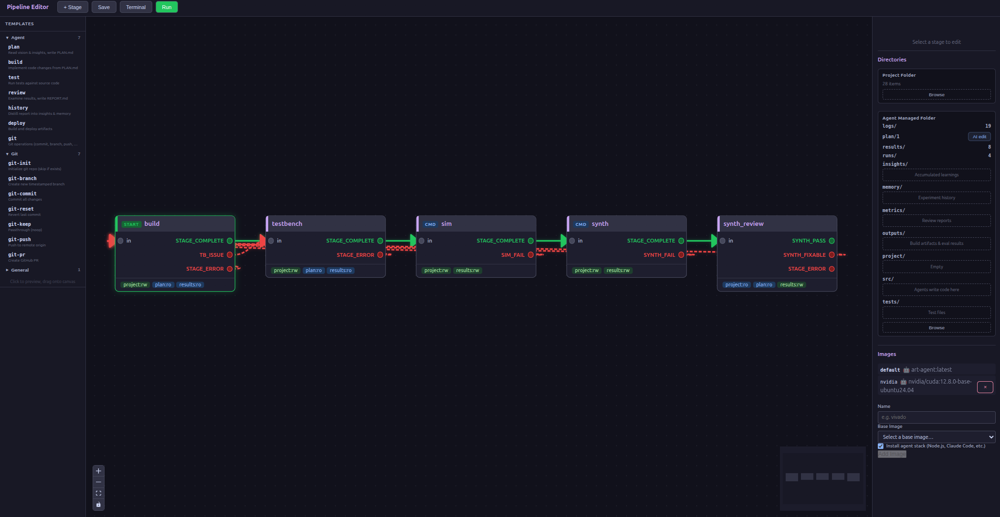
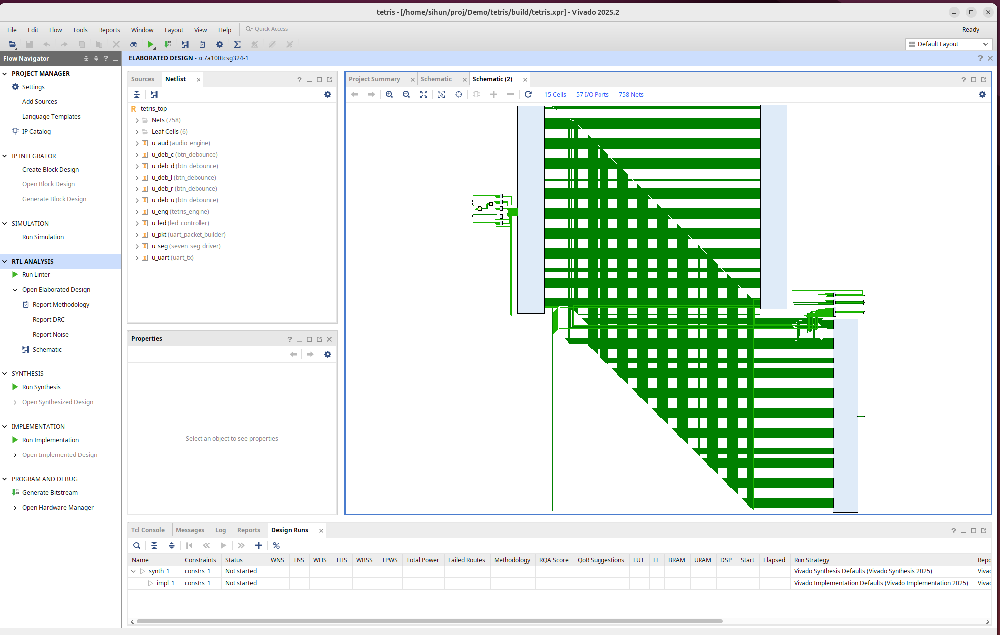
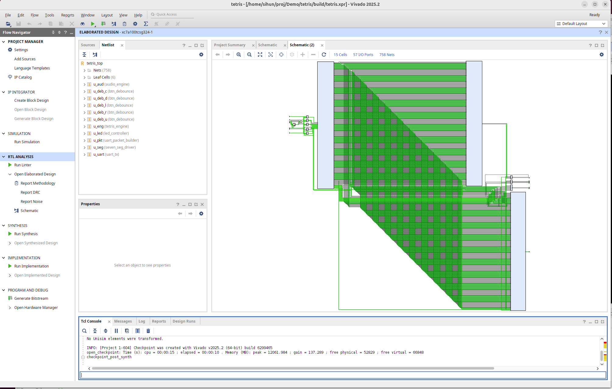

# FPGA Tetris

A fully hardware-implemented Tetris game in SystemVerilog. No CPU. No firmware. Pure RTL.

> Built using [**Art**](https://github.com/aer-org/art) — a 4-stage autonomous AI pipeline that writes HDL, generates tests, runs Vivado, and reviews synthesis in a self-healing loop.

**Target:** Nexys A7-100T (Xilinx Artix-7 XC7A100T-1CSG324C) | **Clock:** 100 MHz single domain | **Toolchain:** Vivado 2025.2

## Features

- **Full Tetris gameplay** — 7 tetrominoes with SRS wall kicks, gravity per level, lock delay (500ms, 15 resets), ghost piece, soft & hard drop
- **5-button control** — BTNL/R movement, BTNU rotate, BTND drop, BTNC start/pause. SW[0] hard-drop toggle, SW[15] master reset. 20ms debounce + DAS auto-repeat (200ms initial, 50ms repeat)
- **7-segment score display** — 8 multiplexed digits showing `Lv.XX SSSS` at 1 kHz refresh with custom `L`/`v` glyphs
- **PWM audio synthesis** — 7 distinct sound effects (move tick, rotate click, lock thud, line sweep, tetris fanfare, hard drop slam, game over descend), 100-1200 Hz with frequency sweeps
- **UART live display** — 216-byte binary protocol with checksum, full board + piece + score transmitted on every game event for PC terminal rendering (115200 baud, ~53 packets/sec)
- **16 context-aware LEDs** — Larson scanner on title, board fill meter during play, 2 Hz blink when paused, all solid on game over

## Module Hierarchy

```
tetris_top ── Top-level port mapping
├── tetris_engine ─── Game FSM, board state, scoring (~850 lines)
├── collision_checker  Combinational 4x4 vs 10x20 board check
├── piece_rom ──────── 28 bitmasks (7 pieces x 4 rotations)
├── btn_debounce x5 ── 20ms debounce + edge detect
├── lfsr_rng ───────── 16-bit LFSR, rejection sampling
├── uart_tx ────────── 115200 baud, 8N1
├── uart_packet_builder 216-byte game state serializer
├── seven_seg_driver ── 8-digit MUX @ 1 kHz
├── led_controller ──── Larson scanner + fill meter
└── audio_engine ────── PWM synth, 7 sound effects
```

## How It Was Built — AerArt Pipeline

This project was developed using [art](https://github.com/aer-org/art), an autonomous AI agent pipeline that iterates through build-test-synthesize-review cycles with self-healing feedback loops.



**Pipeline stages:**

| Stage | Type | Role |
|-------|------|------|
| **Build** | Agent | Reads PLAN.md spec, implements/fixes SystemVerilog modules |
| **Testbench** | Agent | Generates self-checking `tb_top.sv` with PPM frame rendering |
| **Sim** | Command | Vivado xsim — compile, elaborate, simulate with pass/fail detection |
| **Synth Review** | Agent | Analyzes Vivado timing/utilization reports, writes fix guidelines |

Simulation failures route back to Build. Synthesis timing violations trigger targeted fixes via `synth_review.md` guidance. Agents communicate through file-based artifacts — no shared memory.

**Example of self-healing:** the pipeline caught a runtime division in `audio_engine.sv` causing a -52ns timing violation (WNS). The review agent wrote fix guidelines, and the build agent replaced it with precomputed lookup tables.

## Synthesis Results

| Resource | Usage |
|----------|-------|
| LUT | 3-6% of XC7A100T |
| FF | 1-2% |
| BRAM | 0 |
| DSP | 0 |




## Building

Requires Vivado 2025.2 with Artix-7 support.

```bash
make synth    # Run synthesis + place & route
make sim      # Run simulation testbench
make program  # Program the Nexys A7 board
```

## PC Display

`display.py` receives UART packets and renders the game board in the terminal with ANSI colors:

```bash
python display.py /dev/ttyUSB1
```

## Project Stats

| Metric | Value |
|--------|-------|
| RTL modules | 11 |
| Lines of SystemVerilog | ~1700 |
| Piece bitmasks | 28 |
| UART packet size | 216 bytes |
| Sound effects | 7 |
| Clock domain | Single, 100 MHz |

## Presentation

See [presentation/FPGA-Tetris-Presentation.pdf](presentation/FPGA-Tetris-Presentation.pdf) for the full project deck.
